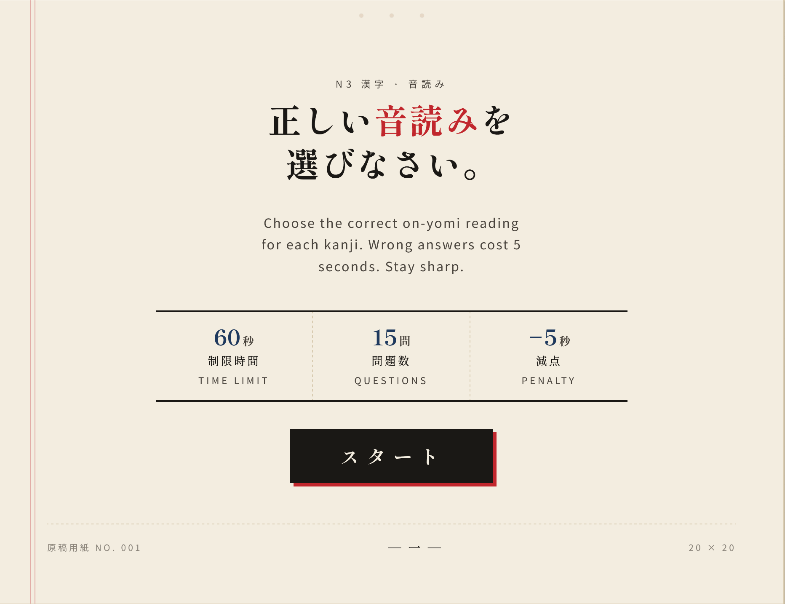

# N3漢字クイズ — Genkō Yōshi Edition

## Description
A JLPT N3 kanji drill that tests on-yomi (Chinese-derived) readings across 15 questions. The UI is styled as a genkō yōshi manuscript notebook — cream kraft paper, sumi ink, indigo and vermilion school colors, with Shippori Mincho and Noto Sans JP typography. Originally built to practice DOM manipulation and JavaScript function design; later overhauled to add a full aesthetic redesign, animated feedback, a ranked leaderboard, and a live-tweakable theme system.

## Table of Contents
- [Installation](#installation)
- [Usage](#usage)
- [Features](#features)
- [Credits](#credits)
- [Tests](#tests)

## Installation
The page is deployed in Vercel. Use [this link](https://pop-quiz-tan.vercel.app/) to access.

## Usage
1. Click **スタート** to begin. A 60-second countdown ring starts immediately.
2. Each screen shows one kanji in a manuscript-paper cell. Select the correct on-yomi reading from four katakana options (labeled 甲/乙/丙/丁).
3. A correct answer stamps a vermilion 「正解」 hanko on the kanji. A wrong answer scratches out your choice and reveals the correct one; 5 seconds are deducted from the timer.
4. After all 15 questions (or when the timer hits zero), the results screen shows your score, a review of any missed kanji with their correct readings, and a form to log your initials.
5. Logged scores are saved to `localStorage` and displayed in a ranked table (順位 · イニシャル · スコア · 日付). Click **もう一度** to return to the start screen.
6. Use the **調整** button (bottom-right) to switch aesthetic, light/dark mode, and ornament density at any time — settings persist across sessions.

## Features
- **15 JLPT N3 kanji questions** — on-yomi multiple choice with four katakana options per question
- **SVG countdown ring** — animates in real time; turns vermilion and pulses in the final 10 seconds
- **10-dot progress strip** — indigo for correct, vermilion for missed, animated current-question indicator
- **Ink-bleed reveal** — each kanji fades in with a blur-to-focus animation on every new question
- **Hanko stamp animation** — vermilion 「正解」 seal stamps onto the kanji cell for correct answers
- **Wrong-answer reveal** — scratched-out styling on the chosen button; correct answer highlighted with a dashed green border
- **Paper-flip transition** — 3D card-flip animation between questions
- **Missed-question review** — end screen lists each missed kanji alongside its correct on-yomi reading
- **Ranked leaderboard** — top 10 scores sorted by score then date, with rank/initials/score/date columns; supports Enter-key submission
- **Tweaks panel** — live-switch between four aesthetics (原稿 / 教科書 / 塾 / 墨絵), light/dark mode, and three ornament densities; all persisted to `localStorage`
- **Responsive layout** — single-column answer grid and collapsed header on narrow screens

## Credits
- Coding bootcamp instruction team including TAs, instructors, and tutors.
- [Claude Code](https://claude.ai/code) — functionality improvements, bug fixes, and code quality optimization.
- [Claude Design](https://claude.ai/design) — UI/UX redesign (genkō yōshi aesthetic, animations, tweaks panel).

## Tests
Tested manually by playing through the quiz in-browser: verifying timer accuracy, correct/wrong feedback animations, missed-question review, leaderboard persistence across page reloads, and all tweaks-panel combinations.
