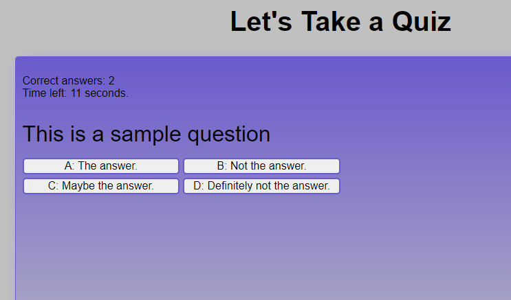

# pop_quiz
## Description
Provide a short description explaining the what, why, and how of your project. Use the following questions as a guide:
The page has a quiz aplication that keeps up with your score and saves it to local storage.
The motivation for this project was to learn how to create a complex network of functions in Javascript and to practice logging objects to the console.
Another motivation for creating this was to practice DOM manipulation through Javascript.
## Table of Contents
- [Installation](#installation)
- [Usage](#usage)
- [Credits](#credits)
## Installation
The page is accesible through [this link](https://jmarq019.github.io/pop_quiz/)
## Usage
The quiz is used by clicking on the start button to begin, and clicking on the answer buttons to submit an answer. At the end of the quiz, you can enter your initials and log your score to be saved in local storage, or you can start the quiz again.

## Credits
Credits to the coding bootcamp instruction team including TA's, instructors and tutors.
## Features
If your project has a lot of features, list them here.
## Tests
Testing was done by using the application on the page.